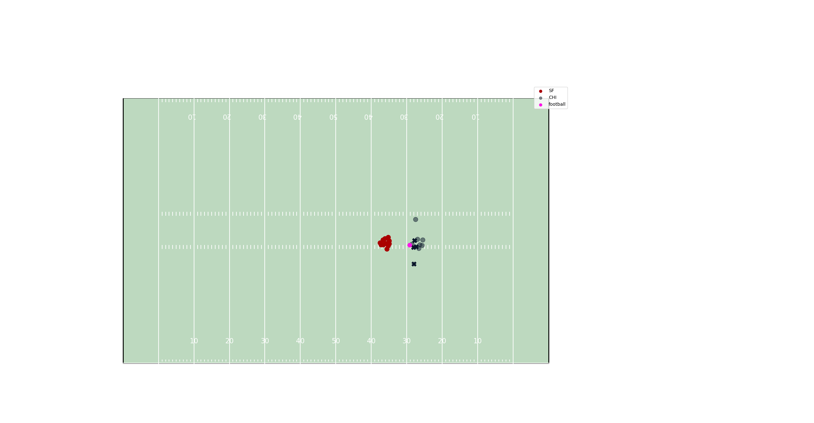

# NFL blitz predictions using player tracking data!

This project utilizes the player tracking data from the NFL's big data bowl to predict players who will blitz on a given play.
Tracking data comes from weeks 1-9 of the 2022 NFL season. For this project, I use the term 'blitz' to refer to any defender who is a pass rusher. Therefore, only plays where defenders are described as "either pass rushing or not" are included (i.e. not run plays).


## 🚀 Getting Started

### 1. Clone the repository

```bash
git clone https://github.com/jacksettles/blitz_predict.git
cd blitz_predict
```

### 2. Set up a virtual environment and install dependencies

```bash
python -m venv fbenv
pip install -r requirements.txt
```

### 3. Download the CSV files from Kaggle

The data is too large to put in this repo, so go to the following link to download the CSV files:

https://www.kaggle.com/competitions/nfl-big-data-bowl-2025/data

Once that is done, place them in data/raw/

### 4. Build the SQLite database

Build and write the .db to the data/ directory. This is taken care of with the following commands.

```bash
PYTHONPATH=. python data_engineering/build_db.py
```

### 5. Process the data

There are two files for processing the data once it is stored in the database.

#### 1. First we have to engineer the labels

Originally I engineered blitzing labels based on a defenders displacement and acceleration. If the defender moved towards the line of scrimmage and their acceleration peaked over a set threshold within the first k frames, I called that a blitz. K=15 in that insance. This is seen in ```data_engineering/old_label_engineering.py```. 

The problem with this was - on run plays especially - sometimes defenders just happen to meet that criteria, even when we would not call it a "blitz". A safety moving down after the snap because it was a run play was very common, so the model kept predicting the safety to blitz from 10+ yards back... unlikely.

Luckily, the players_play.csv file has a feature for wasInitialPassRusher, showing the defenders who started the play as a pass rusher.

To engineer the labels, call:

```bash
PYTHONPATH=. python new_label_engineering.py
```

This file puts the labels next to each player in each frame, plus some other features.

#### 2. Second we have to create the sequences for the model

To build the sequences, call:

```bash
PYTHONPATH=. python create_sequences.py
```

This creates .pt files to be stored in data/processed_data/ for train, val, and test. Train and val follow a 90/10 split, and test is all of week 9's data.

### 6. Train the model!

Currently we are experimenting with Mamba/S6 models from Gu & Dao, 2024. The code for this was adapted from this repo:

https://github.com/johnma2006/mamba-minimal

The model is trained to predict every agent's action at every frame. Each frame is 100 ms apart.

The offense and football are effectively ignored. The model "predicts" these, but these values are always the same, so the model doesn't learn much from them. Future versions will probably just predict the defenders.

Defenders can be either 0 (no blitz), or 1 (blitz).

You can train the model with ```source scripts/run_trainer.sh```. Check the arguments like the name of the save path.

Or, if working with an HPC that has a slurm job scheduler, submit the job with ```sbatch scripts/nfl_train.sh```.
As it stands, I use a batch size of 1 because sequence lengths vary, and I did not want to implement a padding strategy. Padding to the same length for all sequences would be necessary if I wanted to batch samples together. The model takes about 4-5 hours to train on an A100 GPU.

Model is stored in a dictionary (along with the training args) inside a .pt file in ```saved_models/```.
Training progress can be seen in ```progress_outputs/```

### 7. Animate a sequence!

To observe a play, along with the model's predictions for that play, run:

```bash
PYTHONPATH=. python src/create_animation.py
```

Check the args for this file. Ideally you can save the file as an mp4, but if not, then a .gif will be saved. Below is an example gif from a Giants vs. Cowboys game:

